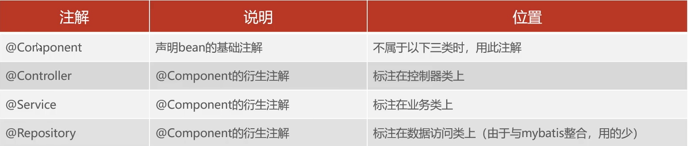
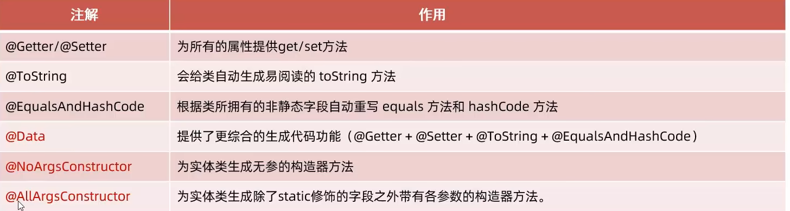

### SpringBoot框架
1. DispatcherServlet：前端控制器
   * HttpServletRequest:获取请求数据
   * HttpServletResponse：设置相应数据

2. 获取请求参数
   1. request.getParameter(String s);
   2. SpringBoot方式：
      * 请求参数名与函数形参变量名，定义形参即可接收参数，且会自动转换。
      * 如果形参名称不匹配，不会接收到数据；可以用@RequestParam(name=),完成映射.
        * @RequestParam有个属性required，默认true，也就是说请求参数必须传递。
   
3. 实体参数
   1. 简单实体
      * 将请求参数封装到一个对象中，请求参数名和形参对象属性名相同
   2. 复杂实体
      * 请求参数名与形参属性名相同，按照对象层次结构关系即可接收嵌套POJO属性
<br><br>
4. 数组参数
   * 请求参数名与形参数组名称相同且请求参数为多个，定义数组类型形参即可接收
   * 集合参数：请求参数名与形参集合名称相同且请求参数为多个,@RequestParam绑定参数关系
<br><br>
5. 日期参数
   * 使用@DateTimeFormat注解完成日期参数格式转换
     ```
     @RequestMapping("/dateParam")
     public String dateParam(@DateTimeFormat(pattern = "yyyy-MM-dd HH:mm:ss") LocalDateTime updateTime){
        System.out.println(updateTime.toString());
        return "OK~";
     }
     ```
    <br><br>
6. Json参数
   * JSON数据键名与形参对象属性名相同，定义POJO类型参数即可接收，需要@RequestBody标识
   
7. 路径参数：
   * 通过请求URL直接传递参数，使用{...}来标识路径，需要使用@PathVariable获取路径参数
   * 可以请求多个参数
     ```
     @RequestMapping("/path/{id}")
     public String pathParam(@PathVariable Integer id){
        System.out.println(id);
     return "OK~";
     }
     ```
<br><br><br>
#### 设置响应数据
1. @ResponseBody
   * 方法注解、类注解
   * 位置：Controller方法/类
   * 作用：将方法返回值直接响应，如果返回值类型是实体对象/集合，将会转换为JSON格式
   * 说明：@RestController=@Controller+@ResponseBody;

2. 方便管理维护，统一响应返回值为Result
   * 响应码、提示信息、返回数据

* 注：Springboot项目的静态资源默认放在：classpath:/static、classpath:/public

#### 分层解耦
1. 三层架构：
   * controller：控制层，接收前端发送的请求，对请求进行处理，并响应数据
   * service：业务逻辑层，处理具体的业务逻辑
   * dao：数据访问层(持久层),负责数据访问操作，增删改查

2. 分层解耦：高内聚低耦合  
   * 内聚：软件中各个功能模块内部的功能联系
   * 耦合：衡量软件中各个层/模块之间的依赖、关联程度
   * 控制反转：Inversion Of Control，简称IOC。对象的创建控制权由程序自身转移到外部（容器)，这种思想称为控制反转。
   * 依赖注入：Dependency Injection，简称DI。容器为应用程序提供运行时，所依赖的资源，称之为依赖注入。
   * Bean对象：IOC容器中创建、管理的对象，称之为bean。

#### IOC&DI
1. 快速入门
   * @Component //将当前类交给IOC容器管理，成为容器中的bean
   * @Autowired //运行时，IOC容器会提供该类型的bean对象,默认按照类型注入
<br><br>
2. IOC详解
   * 要把某个对象交个容器管理，需要在对应类上加如下注解之一：
     * 
   * 声明bean的时候，可以通过value属性指定bean的名字，如果没有指定，默认为类名首字母小写。
   * 使用以上四个注解都可以声明bean，但是在springboot集成web开发中，声明控制器bean只能用@Controller
   * Bean组件扫描
     * 前面声明bean的四大注解，要想生效，还需要被组件扫描注解@ComponentScan扫描。
     * @ComponentScan注解虽然没有显式配置，但是实际上已经包含在了启动类声明注解@SpringBootApplication中，默认扫描的范围是启动类所在包及其子包。

3. DI详解
   * @Autowired注解，默认是按照类型进行，如果存在多个相同类型的bean，将会报错。
   * 通过以下几种方式解决
     * @Primary:让当前Bean生效
     * @Autowired+@Qualifier("bean名称")
     * Resource(name="bean名称"),默认按照名称注入
<br><br>
4. lombok
   * 是一个实用的java类库，通过注解的形式自动生成构造器，并可以自动化生成日志变量
   *  


#### Mybatis
1. 新增数据时返回主键
   * @Options(useGeneratedKeys=ture,keyProperty="id")
<br>
2. 数据封装
   * 实体类属性名和数据库表查询返回字段名相同，mybatis会自动封装
   * 不一致则不会封装
     1. 字段起别名
     2. 通过@Results，@Result注解手动封装
        ```
         @Results({
             @Result(column = "dept_id",property = "deptId"),
             @Result(column = "create_time",property = "createTime"),
             @Result(column = "update_time",property = "updateTime")
         })
        ```
     3. 开启mybatis的驼峰命名自动映射开关a_column->aColumn
        * mybatis.configuration.map-underscore-to-camel-case=true
<br><br>
3. 动态sql  
   * \<foreach collection="" item="" separator="" open="" close="">
     ```
     collection:遍历的集合
     item：遍历出来的元素
     separator:分隔符
     open:遍历前拼接的sql片段
     close:遍历结束拼接的sql片段
     ```
   * \<sql id=>：定义可以重复的sql片段
   * 和\<include>：应用定义的sql片段
